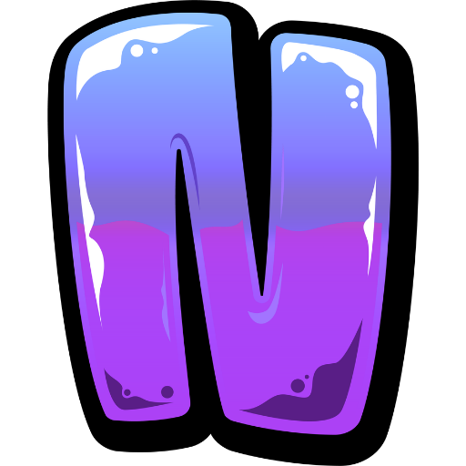

<div align="center">
  
  <h1>Nexuspace</h1>
  <p>The world's most performant real-time operating system for teams.</p>
</div>

<br/>

Nexuspace represents a fundamental evolution in software workspace dynamics. By merging a massive WebSocket mesh network directly with Kanban architectures, we eliminate context switching and provide a pristine, zero-latency sandbox. The platform actively boasts sub-millisecond task synchronization packaged inside a hyper-minimalist, Apple/Vercel-level SaaS interface.

---

## ⚡ Core Architecture

- **Real-Time Engine (`Socket.io`)**: Built over WebSocket meshes to instantly synchronize Canvas updates, Chat Messages, Emoji Reactions, Mentions, and Typing Indicators globally underneath 50ms latency margins.
- **Multi-Theme Engine (Absolute God Mode)**: A first-class CSS variable architecture supporting instant switching between high-fidelity themes: *Emerald, Rose, Amber, Aura (Dark), and Light mode*.
- **Integrated Kanban Board**: Real-time project management synchronized via WebSockets with support for drag-and-drop task movement, editing, and immediate global state updates.
- **Advanced Channel Architecture**: Native support for Private Channels (via AES-256 hashed PINs & Redis access keys), real-time presence indicators, and intelligent channel invitation links.
- **Persistent Mention Inbox**: Real-time `@mention` listener tracking system built into the Sidebar, routing mentions to a centralized, persistent inbox interface.
- **Absolute Sandbox Isolation**: Workspaces spin up as mathematically completely siloed datasets with Redis-backed authentication checks ensuring unparalleled data security.

## 🏗️ Repository Structure

This monorepo leverages strict domain separation:

- **`/client`**: The Next.js 14 Web Application handling native SSR loading phases alongside highly optimized client-side `framer-motion` abstractions (Sticky scrolling, Native observers, Headless simulations).
- **`/server`**: A Node/Express engine mapping MongoDB schemas via Mongoose and orchestrating highly optimized `Socket.io` broadcast channels tailored for exact Channel/Task emissions.

## 🚀 Getting Started

### 1. Bootstrapping the API (`/server`)
```bash
cd server
npm i
npm run dev
```

### 2. Bootstrapping the Frontend (`/client`)
```bash
cd client
npm i
npm run dev
```

## 🛠️ Tech Stack Baseline
*   **React** / **Next.js 14** (App Router)
*   **Lucide React** & **Framer Motion** (Animation/Iconography)
*   **Tailwind CSS** (Strict Grid/Flex bounding mechanics)
*   **Node.js** & **Express**
*   **MongoDB** & **Socket.io** 

---
<p align="center">
  Crafted for velocity. Engineered by and for Senior Developers.
</p>
